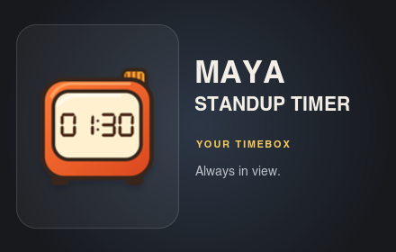
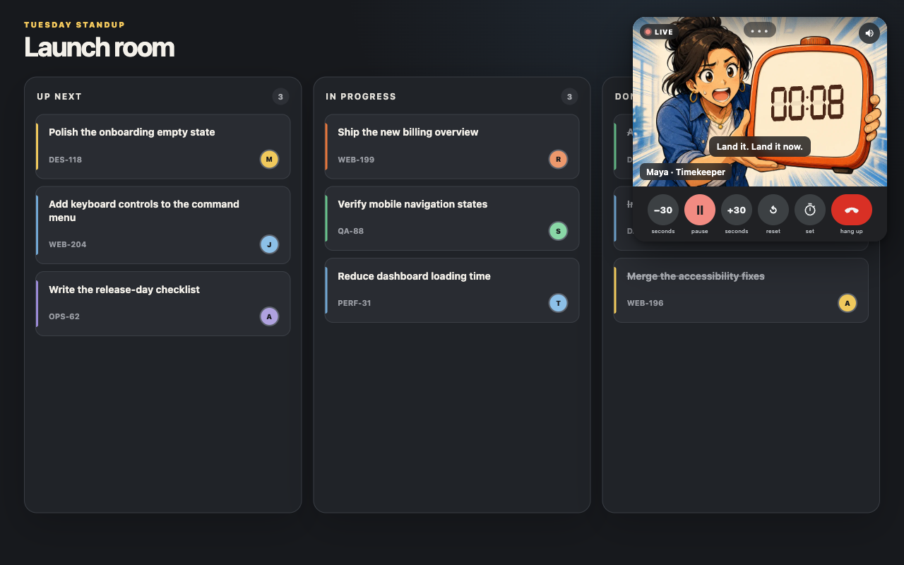

<p align="center">
  
</p>

# Maya

Maya is a lively manga standup timer that stays visible over the meeting or board you are already using. She holds the clock, reacts as the timebox drains, speaks through Meet-style captions, and keeps the product deliberately focused on one job: the timer.

> **Chrome Web Store status:** Maya 1.1.0 has been submitted and is awaiting review. Until the listing is approved, install the extension unpacked using the command below.



## Install the unpacked extension

Download the latest extension source to `~/Downloads/maya-unpacked`:

```bash
curl -fsSL https://raw.githubusercontent.com/brianjmeier/maya/main/install.sh | bash
```

The installer prints the final folder and preserves an existing installation as a timestamped backup. To use a different absolute destination:

```bash
curl -fsSL https://raw.githubusercontent.com/brianjmeier/maya/main/install.sh | MAYA_INSTALL_DIR=/path/to/maya-unpacked bash
```

Then install it in Chrome:

1. Open `chrome://extensions`.
2. Enable **Developer mode**.
3. Click **Load unpacked**.
4. Select `~/Downloads/maya-unpacked`, or the custom directory printed by the installer.
5. Pin **Maya Standup Timer** from Chrome's Extensions menu.
6. Open an ordinary `http://` or `https://` page and click Maya's toolbar icon.

After downloading an update into the same directory, click **Reload** on Maya's card in `chrome://extensions`.

## What Maya does

- Runs as a compact, draggable overlay above the page you choose
- Provides 1:00, 1:30, and 2:00 presets, a typeable time display, and hold-to-repeat ±15-second setup controls
- Supports start, pause, resume, reset, and quick ±30-second adjustments
- Counts upward in overtime instead of disappearing, with a +30-second rescue
- Keeps Maya continuously alive with breathing, glances, reactions, captions, warning panels, and celebrations
- Generates local sound cues for the final stretch and overtime, with a remembered mute control
- Synchronizes timer state, position, and mute preference locally across open overlays
- Honors reduced-motion preferences

Maya has no accounts, participant lists, meeting history, analytics, advertising, remote code, or network service. It requests only `activeTab`, `scripting`, and `storage`.

## Development

Requires Node.js 20 or newer.

```bash
npm install
npm test
npm run build
```

Run the local preview with:

```bash
npm run dev -- --host 0.0.0.0 --port 4173
```

Build and verify the Chrome Web Store package with:

```bash
npm run extension:package
npm run extension:verify
```

Generated release artifacts are written to `release/`. Extension implementation details live in [`extension/README.md`](extension/README.md), and the exploratory Google Meet direction lives in [`docs/google-meet-v2.md`](docs/google-meet-v2.md).

## License

[MIT](LICENSE) © 2026 Brian Meier
